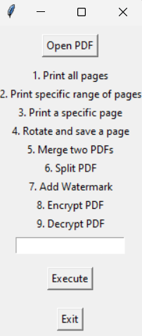

# PDF Manager App

**PDF Manager App** is a powerful and intuitive Python-based GUI application designed for managing and manipulating PDF files. Whether you need to merge, split, encrypt, decrypt, rotate, or watermark your PDFs, this app provides an all-in-one solution for your PDF handling needs.

## Features

This application allows you to perform a variety of PDF-related tasks, all in a user-friendly interface:

### Core Features:
1. **Open PDF**: Load and view the contents of a PDF file for processing.
2. **Print All Pages**: Display the entire content of the PDF in a scrollable output window.
3. **Print Specific Pages**: Extract and view specific pages or a range of pages.
4. **Rotate and Save a Page**: Rotate any page by 90 degrees and save it as a new PDF.
5. **Merge PDFs**: Combine two PDFs into a single file.
6. **Split PDF**: Split a PDF into two parts at a specified page.
7. **Add Watermark**: Add a custom watermark to all pages of a PDF.
8. **Encrypt PDF**: Secure your PDF by encrypting it with a password.
9. **Decrypt PDF**: Remove password protection from encrypted PDFs.

## Screenshot Example

Below is a preview of the main interface. The app lists operations that can be performed, allowing users to select and execute them with ease.

<p align="center">
  
</p>

## Installation

To get started with the **PDF Manager App**, follow these steps:

1. **Clone the Repository**:
    ```bash
    git clone https://github.com/Shashank-143/PDF-Manager-App.git
    cd pdf-manager-app
    ```

2. **Install the Required Libraries**:
    Install the dependencies listed in the `requirements.txt` file.
    ```bash
    pip install -r requirements.txt
    ```

3. **Run the Application**:
    Launch the app by running the Python script.
    ```bash
    python pdf_manager.py
    ```

## Requirements

Ensure you have the following dependencies installed:

- **Python**
- **PyPDF2** (`pip install PyPDF2`)
- **reportlab** (`pip install reportlab`)
- **tkinter** (`pip install tkinter`)

## Usage Instructions

Once the application is up and running, the process is straightforward:

1. **Open a PDF**: Click the "Open PDF" button to select a PDF file from your local storage.
2. **Select an Operation**: Choose the operation you'd like to perform by typing the corresponding number and clicking "Execute".
3. **Complete the Task**: Follow any additional prompts to complete the operation (e.g., inputting page numbers, adding a watermark, etc.).

### Operations Overview

| Operation Number | Functionality                       | Description |
|------------------|-------------------------------------|-------------|
| 1                | Print All Pages                     | Outputs all pages in the loaded PDF to a scrollable text window. |
| 2                | Print Specific Range of Pages       | Select and print a specific range of pages. |
| 3                | Print a Specific Page               | Print a single page from the PDF. |
| 4                | Rotate and Save a Page              | Rotate a page by 90 degrees and save the rotated version. |
| 5                | Merge Two PDFs                      | Combine two PDFs into one and save it. |
| 6                | Split PDF                           | Split the loaded PDF into two separate files at the specified page. |
| 7                | Add Watermark                       | Add a custom text watermark to every page of the PDF. |
| 8                | Encrypt PDF                         | Encrypt the PDF with a user-defined password. |
| 9                | Decrypt PDF                         | Remove password protection from an encrypted PDF. |

## Contribution Guidelines

Contributions are welcome! If you have ideas for improvements or new features, feel free to open an issue or submit a pull request. Let's make this app even better together.

### How to Contribute:
1. Fork the repository.
2. Create a new branch for your feature or bugfix (`git checkout -b feature/my-feature`).
3. Commit your changes and push to your branch.
4. Submit a pull request to the main repository.


## Acknowledgments

This application wouldn't be possible without the support and functionality provided by:
- **[PyPDF2](https://pypi.org/project/PyPDF2/)** for PDF manipulation.
- **[reportlab](https://pypi.org/project/reportlab/)** for generating and editing PDFs.
- **[Tkinter](https://docs.python.org/3/library/tkinter.html)** for the graphical user interface.
---
